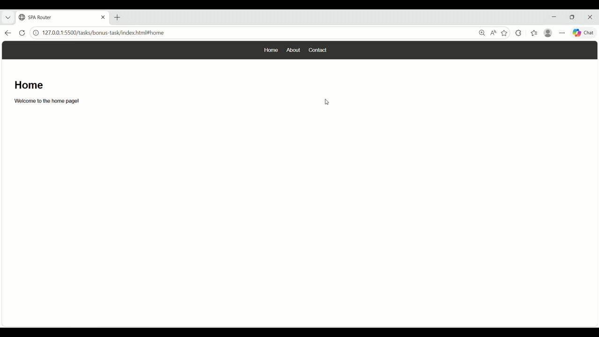

#  Single Page Application (SPA) with Hash-based Routing

##  Objective
Build a basic Single Page Application (SPA) that enables navigation between different views without reloading the page using hash-based routing.

---

##  Demo



---

##  How It Works

This project uses **hash-based routing** to simulate navigation inside a single HTML page.

- Each navigation link updates the URL hash:
  - `#home`
  - `#about`
  - `#contact`

- The application listens to the `hashchange` event:

```js
window.addEventListener("hashchange", router);
```

- Based on the current hash, the router dynamically updates the content inside the app container.

- No page reload occurs — only the content changes dynamically.

---

##  Key Concepts

###  Hash-based Routing
Uses `window.location.hash` to determine which view to display.

###  Event Handling
The `hashchange` event triggers the router whenever the URL changes.

###  Dynamic Rendering
Content is updated using JavaScript (`innerHTML`) instead of loading new pages.

###  State Persistence
Since the page does not reload, application state can be maintained across navigation.

---

##  Features

- No page reload navigation  
- Fast and responsive UI updates  
- Simple routing logic using JavaScript  
- Works on static hosting (no backend required)  

---

##  Project Structure

```
project/
├── index.html
├── script.js
├── demo.gif
└── BONUS-TASK.md
```


##  Difference: `window.location.href` vs `hashchange`

| Feature              | `window.location.href`                  | `hashchange`                          |
|---------------------|----------------------------------------|--------------------------------------|
| Page Reload         | ✅ Reloads entire page                 | ❌ No reload                         |
| Navigation Type     | Full navigation (browser + server)     | Client-side navigation (JavaScript)  |
| Performance         | ❌ Slower (network + re-render)        | ⚡ Faster (DOM update only)          |
| State Preservation  | ❌ State is lost                       | ✅ State is preserved                |
| Server Request      | ✅ Sends request to server             | ❌ No server request                 |
| URL Format          | `/about`                               | `#about`                             |
| Use Case            | Redirects, external links, MPAs        | SPA routing                          |

---
**`href` = page reload navigation**  
**`hashchange` = SPA navigation without reload**