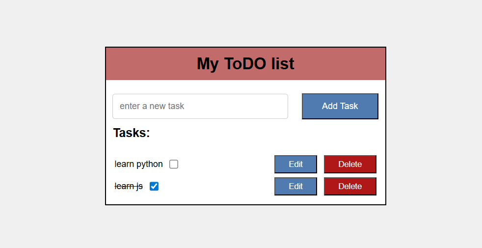
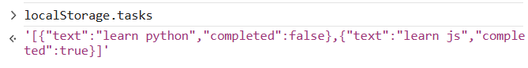

# 📝 To-Do List App (LocalStorage)

## 📷 Screenshot

---

## 📌 Objective
Create a To-Do app to add, edit, delete, and manage tasks with persistent storage.

---

## ⚙️ Implementation

- Built UI using HTML:
  - Input field for task entry
  - Add button
  - Task list display

- Used JavaScript to:
  - Add new tasks
  - Render tasks dynamically
  - Store and retrieve tasks from `localStorage`

- Each task contains:
  - `text` → task name
  - `completed` → status (true/false)

---

## 🔧 Features

- ➕ Add Task  
- ✏️ Edit Task  
- 🗑️ Delete Task  
- ✅ Mark as Completed  
- 💾 Data persistence using localStorage  

## 📂 Project Structure

todo-app/  
│── todo.html  
│── style.css  
│── todo.js  
│── screenshot.png  
│── todo.md  