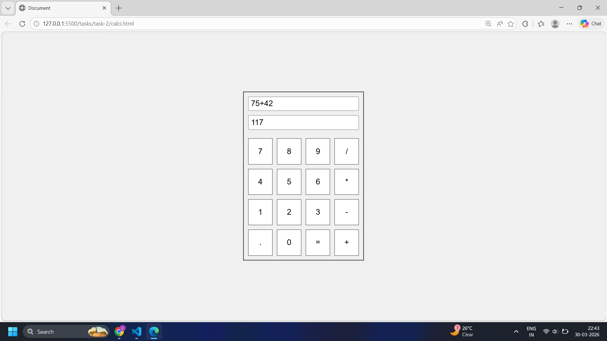

#  Simple Calculator

## 📷 Screenshot

---

##  Implementation

This project is a basic calculator built using HTML, CSS, and JavaScript.

- Designed the layout using HTML:
  - An input field to display the entered expression
  - A readonly field to show the result
  - Buttons for digits (0–9), operators (`+`, `-`, `*`, `/`), decimal (`.`), and equals (`=`)

- Implemented functionality using JavaScript:
  - Selected all buttons and input fields using DOM methods
  - Added click event listeners to each button
  - When a number or operator is clicked, it is appended to the input field
  - When `=` is clicked, the expression is evaluated using `eval()`
  - Used `try-catch` to handle invalid expressions and display `"Error"`

---

## Project Structure

calculator/  
│── index.html  
│── calci.css  
│── calci.js  
│── task-2.png  
│── task-2.md  