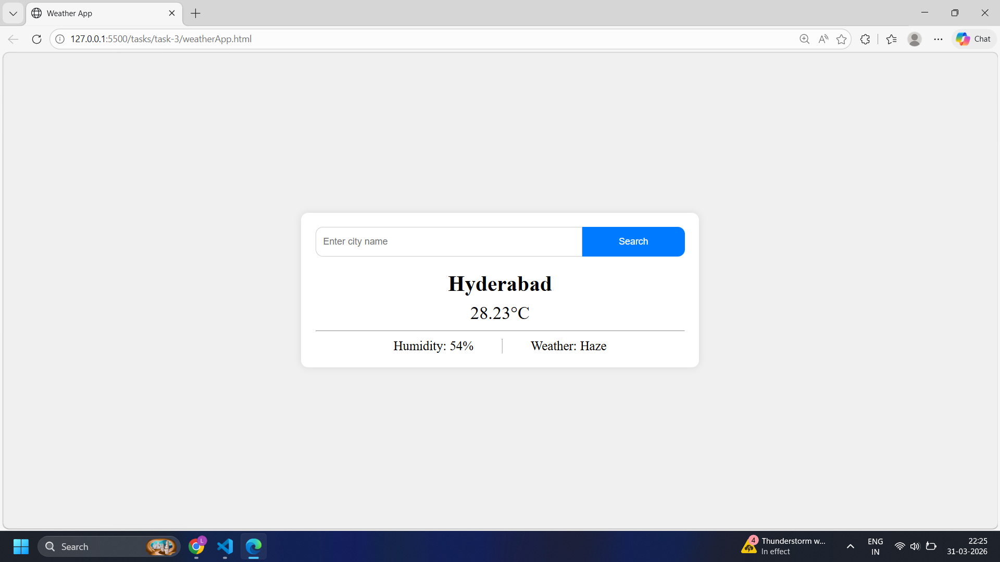

# 🌦️ Weather App (API Integration)

## 📷 Screenshot

---

## 📌 Objective
Create a weather app that fetches and displays weather details based on a city name using a public API.

---

## ⚙️ Implementation

- Designed a simple UI using HTML:
  - Input field for city name
  - Search button
  - Sections to display temperature, weather, and humidity

- Used JavaScript with Fetch API to:
  - Send request to OpenWeatherMap API
  - Parse JSON response
  - Update DOM with:
    - City name
    - Temperature
    - Weather condition
    - Humidity

- Added error handling:
  - Show error if input is empty
  - Show error if city is not found
  - Handle network/API errors using `try-catch`
  - Hide error message by default and display only when needed

- Improved UI behavior:
  - Clear input field after search
  - Show data only after successful response
  - Dynamically display separators (`hr`) after data loads

---

## 🔗 API Used
- OpenWeatherMap Current Weather API

---

## 📂 Project Structure

weather-app/  
│── weatherApp.html  
│── style.css  
│── weatherApp.js  
│── screenshot.png  
│── weatherApp.md  