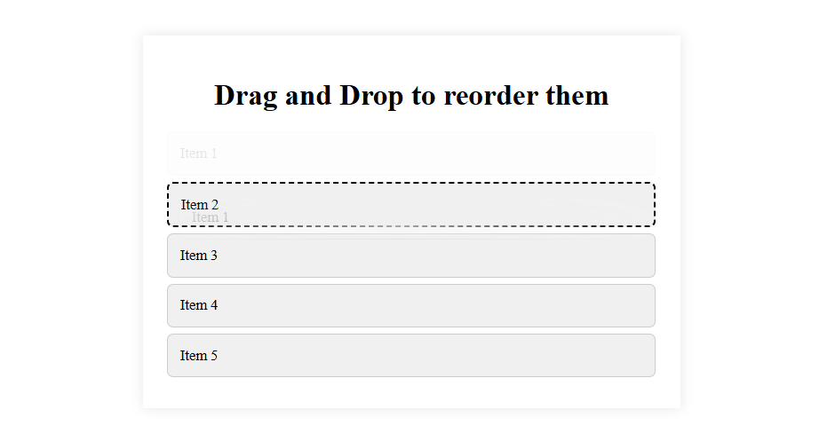

#  List Reordering

##  Screenshot

## 📌 Overview
Implements list reordering by tracking the dragged item and updating its position based on where it is dropped.

---

##  Steps

- **Select Elements**
  - Get all list items and parent list
  - Use a variable to store the dragged item

- **Drag Start**
  - Store the dragged item
  - Add visual effect (opacity)

- **Drag Over**
  - Allow dropping using `preventDefault()`
  - Highlight the target item

- **Drop**
  - Remove highlight
  - Check if dragged item ≠ target item
  - Find positions (indexes) of both items
  - Compare positions:
    - Dragging down → place after target
    - Dragging up → place before target
  - Update order using DOM insertion

- **Drag End**
  - Remove dragging styles

---
